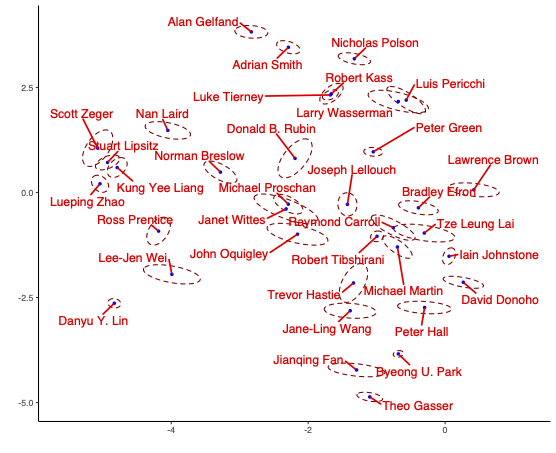

## Embedding General Sparse Hypergraphs with Non-uniformity and Multiplicity

Code in this repository reproduces the results in  
[A general latent embedding approach for modeling non-uniform high-dimensional sparse hypergraphs with multiplicity](https://arxiv.org/abs/2410.12108) using R.

**Folders and files**:

- **`cocitation_network_analysis/`**  
  Contains the code and data for the co-citation hypergraph analysis. See the folder for details.

- **`simulation/`**  
  Contains the code and data for the simulation results in the manuscript. See the folder for details.  

- **`HGraphEmbed.zip`**  
  An R package implementing hypergraph embedding with Rcpp.  

**Reproducibility guide**:

- To reproduce Figures 2 and 3 in the paper, first run `./simulation/Theta_result.R` with seeds 1, ..., 100 and save the results. Then aggregate the results using `./simulation/evaluate_Theta.R`.

- To reproduce Figures 4 and 5 in the paper, first run `./simulation/coverage_result.R` with seeds 1, ..., 1000 and save the results. Then aggregate the results using `./simulation/evaluate_coverage.R`.

- To reproduce Figures 6-8 in the co-citation hypergraph analysis in the paper, run `./cocitation_network_analysis/learn_the_embeddings.R` to generate the embeddings and use `./cocitation_network_analysis/learn_the_crs.R` to produce the plots.

- To reproduce Figures 1-6 in the Supplmentary material, run `supp.R`.

**Author embedding plot from the co-citation hypergraph**:

