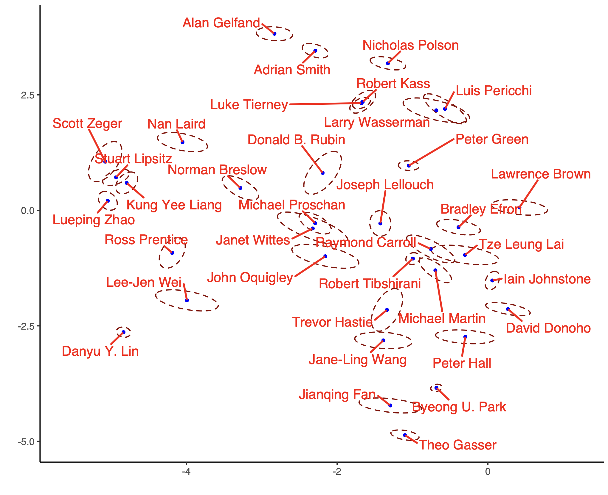

## Embedding General Sparse Hypergraphs with Non-uniformity and Multiplicity

To reporduce the results in [A general latent embedding approach for modeling non-uniform high-dimensional sparse hypergraphs with multiplicity.](https://arxiv.org/abs/2410.12108) using R. 

**Files**:

**Author embedding plot from the co-citation hypergraph**:

